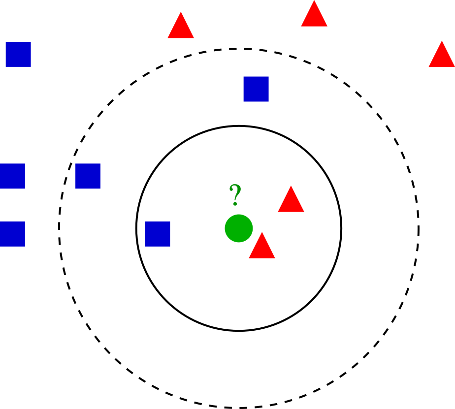

# Setup

<link rel="stylesheet" href="headers.css">

```{r setup}
# .libPaths(new = "/scratch/local/rseurat/pkg-lib-4.1.3")

suppressMessages({
  library(tidyverse)
  library(Seurat)
})


set.seed(8211673)

knitr::opts_chunk$set(echo = TRUE, format = TRUE, out.width = "100%")


options(parallelly.fork.enable = FALSE,
        future.globals.maxSize = 8 * 1024 ^ 2 * 1000)

plan("multicore", workers = 8)
```

```{r useful-information, echo=FALSE}
cat("work directory: ", getwd())
cat("\n")
cat("library path(s): ", .libPaths())
```

# Load Data

We'll be working with the data from Day 1 ("First steps"), let's quickly re-load and re-process again:
We also will want to visualize on the UMAP projections, so make sure you have also run that. 

```{r initial, warning=FALSE}
sample <- readRDS("../sample_processed.RDS")


```

## Clustering

The next step follow the work pioneered by `PhenoGraph`, a robust computational method that partitions high-dimensional single-cell data into subpopulations.
Building on these subpopulations, `PhenoGraph` authors developed additional methods to extract high-dimensional signaling phenotypes and infer differences in functional potential between subpopulations.
<!-- For details, be sure to check the [research paper](http://www.ncbi.nlm.nih.gov/pubmed/26095251) cited by seurat developers. -->

This subpopulations *could* be of biological relevance, retrieving these is our goal.
The definition of such groupings depend upon the parameters.
This algorithm in particular is the K Nearest Neighbors (KNN) graph that is constructed based on the euclidean distance in PCA space.
For an example of building such a graph, imagine we took only two PCs (principal components) and had such an arrangement of cells like these dots in a 2D plane...




```{r, echo=FALSE}
#
```

On our example of k-NN classification for a cell highlighted in green color, the test sample (green dot) should be classified either to the group made of blue squares or to the subpopulation of cells here represented in red triangles.
If k = 3 (solid line circle) it is assigned to the red triangles because there are 2 triangles and only 1 square inside the inner circle.
If k = 5 (dashed line circle) it is assigned to the blue squares (3 squares vs. 2 triangles inside the outer circle).

There's a drawback with the 'majority voting' scheme, the assignment of such clusters is biased towards the clusters that have greater number of members (especially when ties start appearing).
For that reason, we'll refine the process by using a graph, where edge weights between any two cells is based on the shared overlap in their local neighborhoods (Jaccard similarity).

$$
J(A,B) = \frac{Intersect(A,B)}{Union(A,B)} = J(B,A)
$$

**If two datasets share the exact same members, their Jaccard Similarity Index will be 1. Conversely, if they have no members in common then their similarity will be 0.**

All the process described before, including the use of Jaccard Similarity Index is performed using the `FindNeighbors()` function, and takes as input the previously defined dimensionality of the dataset (first 10 PCs).
So the KNN is build using multidimensional space, but the rules we just saw for 2D still apply.

> 🧭✨ Task: Which is the default value of the parameter `K` that Seurat uses?
> Hint: `help` yourselves by reading the docs!

```{r findneighbours}
sample <- FindNeighbors(sample, dims = seq_len(10))
```

We want to keep our clusters looking natural.
That is, we want to have a modularity optimization on top of all.
For that, we'll use the community search algorithm for graphs called Louvain.
You can read more about it [here](https://scribe.froth.zone/louvain-algorithm-93fde589f58c?gi=8dce35ee2f75), or to read about it being applied to the biological problem at hand look into [this research paper](http://dx.doi.org/10.1088/1742-5468/2008/10/P10008).

The `FindClusters()` function implements this procedure, and contains a `resolution` parameter that sets the 'granularity' of the downstream clustering, with increased values leading to a greater number of clusters.
Usually, setting this parameter between `0.4` and `1.2` returns good results for single-cell datasets of around 3K cells.
You can easily try various values and see how it performs.
Optimal resolution often increases for larger datasets.


```{r findclusters}
sample <- FindClusters(sample, resolution = 0.5)

umap <- do_DimPlot(sample, reduction = "umap", label = TRUE )
```

> 🧭✨ Polls:
>
>
> What would happen if we ran `FindVariableFeatures` after `ScaleData`?
>
> What would happen if we skip `ScaleData`?
> Would PCA be affected?
>
> What would happen if we skip `NormalizeData`?
> Would UMAP be affected?
>
> Would it be any difference if we ran `FindNeighbors` and `FindClusters` but only after UMAP?


# Searching for Markers

Having identified (and visualized) clusters of cells we want to learn about the specific genes under differential expression.

We will focus on how to derive **marker genes** for any given groups of cells.
To this end, Seurat has different convenient functions that run **Differential Expression (DE)** tests.
One such function, and the main one is `FindMarkers()`.
Among other parameters, it takes:

-   `ident.1`, and `ident.2`: typically these denote specific cluster numbers ("identities") of cells, but any other annotation from the metadata will work as well.
-   `test.use`: select from a wide range of statistical models and/ or methodologies 
  - Default: Wilcoxon Rank Sum test The Wilcoxon Rank Sum test is a non-parametric statistical test used to determine if there are differences between two groups that are not normally distributed
  - ["MAST"](https://genomebiology.biomedcentral.com/articles/10.1186/s13059-015-0844-5))
  - ["DESeq2"](https://bioconductor.org/packages/release/bioc/vignettes/DESeq2/inst/doc/DESeq2.html#recommendations-for-single-cell-analysis)
  - and more if you consult the documentation 
**MAST controls for the proportion of genes detected in each cell,** this acts as a proxy for both technical (e.g., dropout, amplification efficiency) and biological factors (e.g., cell volume and extrinsic factors other than treatment of interest) that globally influence gene expression.
Another popular option is `DESeq2`, with [plenty of caveats](https://www.bioconductor.org/packages/devel/bioc/vignettes/DESeq2/inst/doc/DESeq2.html#recommendations-for-single-cell-analysis) that the Seurat authors may have addressed.

<!-- This research article that compares different DE testing methodologies/ package libraries for single-cell datasets: <https://www.nature.com/articles/nmeth.4612> -->

```{r}
sample <- readRDS("../sample_processed.RDS")
```
Let's do a comparison between cells that were assigned to either cluster 1 or 2.

```{r findmarkers}
markers1v2 <- FindMarkers(
  object = sample,
  test.use = "wilcox",
  ident.1 = 1, 
  ident.2 = 2,
  verbose = FALSE
)
```

The resulting object is a data frame with the following columns:

-   `p_val`: p-value (unadjusted!)
-   `avg_log2FC` : log fold-change of the average expression between the two groups. Positive values indicate that the feature is more highly expressed in the first group.
-   `pct.1`: The percentage of cells where the feature is detected in the first group
-   `pct.2`: The percentage of cells where the feature is detected in the second group
-   `p_val_adj`: Adjusted p-value, based on Bonferroni correction using all features in the dataset.

You may inspect the results with either `View()` or `head()`.

> 🧭✨ Polls:
>
> Given that genes used for clustering are the same genes tested for differential expression, Would you interpret the (adjusted) p-values without concerns?
>
> Which marker gene is the most expressed in cluster 1 when comparing it to cluster 2?
>
> What would happen if we used `ident.1 = 2`, and `ident.2 = 1` instead?

**Notice**:

-   if `ident.2=NULL` (default), then `FindMarkers()` will run a test between the group `ident.1` and **all other** cells
-   You may also use a vector (e.g. `c(1,3)`) as `ident.2` to compare against all the cells of clusters one and three, pooled together.
-   to increase the speed and relevance of marker discovery, Seurat allows for pre-filtering of features or cells. For example, genes that are very infrequently detected in either group of cells, or genes that are expressed at similar average levels, are unlikely to be differentially expressed, so we can exclude those: `?FindClusters`

There are different flavors of these `Find*` functions.
**It's important to get to know them!**

-   `FindMarkers` will find markers between two different identity groups - you have to specify both identity groups.
    **This is useful for comparing the differences between two specific groups.**

-   `FindAllMarkers` will find markers differentially expressed in each identity group by comparing it to all of the others - you don't have to manually define anything.
    Note that markers may bleed over between closely-related groups - they are not forced to be specific to only one group.

-   `FindConservedMarkers` will find markers that are conserved between two groups - this can be useful if you want to find markers that are conserved between a treated and untreated condition, for a specific cell type or group of cells.
    **It means they are differentially expressed compared to other groups, but have similar expression between the two groups you're actually comparing.**

## Graphical Exploration

Seurat includes several tools for visualizing marker expression.
`VlnPlot` and `RidgePlot` show the probability density distributions of expression values across clusters, and `FeaturePlot()` visualizes feature expression in a reduction (e.g. PCA, t-SNE, or UMAP).
The latter is equivalent to `DimPlot`.

```{r markers_viz}
feats = rownames(markers1v2)[1:2]

SCpubr::do_ViolinPlot(sample, features = feats)

FeaturePlot(sample, features = feats)
```

> ⌨🔥 Exercise: Draw a RidgePlot with the vector `feats`.

## Markers Per Cluster (between)

What are the differences between clusters?
disregarding any other metadata (cell-cycle, treatments, groups, etc).
Let's compare 1 vs all, 2 vs all, ... etc.

For computational efficiency we'll use `sample_small` which is a downsampled sample3K data set bundled with Seurat.
(Yes, it won't appear in your Global Environment but it's ready to be loaded upon execution of code.)

```{r allMarkers_samplesmall}
markers.between.clusters <- FindAllMarkers(
  sample,
  test.use = "wilcox",
  logfc.threshold = 0.5,
  min.pct = 0.3,
  only.pos = TRUE,
  densify = TRUE
)

print(markers.between.clusters)
```

## DotPlot

There is another common visualization technique that involves mapping the percent of cells that express a certain gene to the size of a dot, and color it according to the average expression value.
Here's an example:

```{r dotplot}
DotPlot(sample, features = rownames(markers.between.clusters)[1:10]) + RotatedAxis()
```

```{r}
markers.between.clusters %>% head()
saveRDS(sample,file = "../sample_processed.RDS")
```


Apart from getting and visualizing marker genes, we would ultimately want to see whether there are common functional themes in those marker lists.
This will be covered in the next section.

# End

<!-- fig.asp knitr option sets the height-to-width ratio of the figure.

value < 1 makes the plot wider
value > 1 makes the plot taller

Use in combination with either fig.width and fig.height if needed.
https://bookdown.org/yihui/rmarkdown-cookbook/figure-size.html
-->
